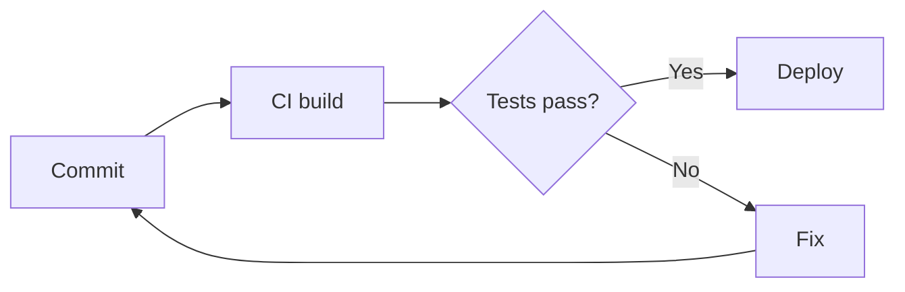

# Markdown Test

A reference document covering standard Markdown syntax for renderer testing.
Sections are grouped by spec: **CommonMark** (core), **GFM** (GitHub Flavoured Markdown), and **Extended** (widely supported but non-standard).

---

## 1. CommonMark — Headings

# ATX Heading 1
## ATX Heading 2
### ATX Heading 3
#### ATX Heading 4
##### ATX Heading 5
###### ATX Heading 6

#### Closed ATX heading ####

Setext Heading 1
================

Setext Heading 2
----------------

## 2. CommonMark — Paragraphs and line breaks

This is a paragraph. Lines that wrap
in the source join into one paragraph.

This line ends with two trailing spaces  
so this should be on a new line (hard break).

This line ends with a backslash\
so this should also be on a new line.

## 3. CommonMark — Emphasis

*Italic with asterisks* and _italic with underscores_

**Bold with asterisks** and __bold with underscores__

***Bold italic*** and ___bold italic___

**Bold with *nested italic* inside**

*Italic with **nested bold** inside*

Intra-word emphasis: un*frigging*believable

## 4. CommonMark — Blockquotes

> A single-line blockquote.

> A multi-line blockquote
> that continues here.
>
> With a second paragraph.

> Nested blockquotes:
>> Level two
>>> Level three

> ### Heading inside a quote
> - List inside a quote
> - Second item
>
> `Code inside a quote`

## 5. CommonMark — Lists

Unordered (asterisk):
* Item one
* Item two
* Item three

Unordered (dash):
- Item one
- Item two

Unordered (plus):
+ Item one
+ Item two

Ordered:
1. First
2. Second
3. Third

Ordered starting at a custom number:
7. Seven
8. Eight
9. Nine

Ordered with parenthesis delimiter:
1) First
2) Second

Ordered with all-ones numbering (should render 1, 2, 3):
1. First
1. Second
1. Third

Nested lists:
1. Parent item
   - Child bullet
   - Child bullet
     1. Grandchild ordered
     2. Grandchild ordered
2. Parent item
   * Mixed marker child

Loose list (paragraphs between items):

- First item

- Second item, with a second paragraph.

  This paragraph belongs to the second item.

- Third item

List item containing a code block:

1. Run this:

```bash
   echo "hello"
```

2. Then continue.

## 6. CommonMark — Code

Inline `code` in a sentence.

Inline code containing a backtick: `` there's a ` here ``

Indented code block (4 spaces):

    function indented() {
      return true;
    }

Fenced code block (backticks), no language:

```
plain fenced block
```

Fenced code block with language:

```python
def greet(name: str) -> str:
    return f"Hello, {name}"
```

Fenced code block with tildes:

~~~yaml
apiVersion: v1
kind: ConfigMap
metadata:
  name: test
~~~

Long line test (should scroll, not wrap the page):

```
this-is-a-very-long-line-of-code-intended-to-test-horizontal-scrolling-behaviour-in-code-blocks-aaaaaaaaaaaaaaaaaaaaaaaaaaaaaaaaaaaaaaaaaaaaaa
```

## 7. CommonMark — Horizontal rules

Three asterisks:

***

Three dashes:

---

Three underscores:

___

Spaced:

* * *

## 8. CommonMark — Links

[Inline link](https://example.com)

[Inline link with title](https://example.com "Example title")

[Relative link](./other-note.md)

[Anchor link to section 3](#3-commonmark--emphasis)

<https://example.com> (angle-bracket autolink)

<mail@example.com> (email autolink)

[Reference link][ref1]

[Reference link, case-insensitive][REF1]

[Collapsed reference link][]

[Shortcut reference link]

[ref1]: https://example.com "Reference title"
[Collapsed reference link]: https://example.com/collapsed
[Shortcut reference link]: https://example.com/shortcut

## 9. CommonMark — Images


![Reference image][img1]

[](https://example.com)

[img1]: https://placehold.co/150x75

## 10. CommonMark — Escaping

\*Not italic\*

\_Not italic\_

\# Not a heading

\- Not a list item

\`Not code\`

\[Not a link\](https://example.com)

Escapable characters: \\ \` \* \_ \{ \} \[ \] \( \) \# \+ \- \. \! \|

## 11. CommonMark — HTML and entities

Entities: &copy; &amp; &lt; &gt; &quot; &nbsp; &#169; &#x1F600;

Inline HTML: <kbd>Ctrl</kbd> + <kbd>C</kbd>, H<sub>2</sub>O, E = mc<sup>2</sup>, <u>underlined</u>, <mark>highlighted</mark>

<div align="center">
  <strong>Block-level HTML</strong>
</div>

<details>
<summary>Click to expand (details/summary)</summary>

Hidden content with **Markdown** inside.

</details>

<!-- This is an HTML comment and should not render -->

---

## 12. GFM — Strikethrough

~~Strikethrough with double tildes~~

~Strikethrough with single tilde~

## 13. GFM — Task lists

- [ ] Unchecked task
- [x] Checked task
- [ ] Task with **bold** and `code`
  - [ ] Nested unchecked
  - [x] Nested checked

## 14. GFM — Tables

Basic table:

| Name | Role | Location |
|------|------|----------|
| Alice | Engineer | Wrexham |
| Bob | Analyst | Atlanta |

Alignment:

| Left | Centre | Right |
|:-----|:------:|------:|
| a | b | c |
| longer text | longer text | longer text |

Inline formatting in cells:

| Syntax | Example |
|--------|---------|
| Bold | **bold** |
| Code | `code` |
| Link | [link](https://example.com) |
| Escaped pipe | a \| b |

Table without leading/trailing pipes:

Column A | Column B
-------- | --------
one | two

## 15. GFM — Extended autolinks

Bare URL: https://example.com

www link: www.example.com

Bare email: someone@example.com

## 16. GFM — Disallowed raw HTML

<script>alert('If you can see an alert, script filtering is off');</script>

<iframe src="https://example.com"></iframe>

---

## 17. Extended — Footnotes

Here is a sentence with a footnote.[^1]

Here is one with a named footnote.[^note]

[^1]: This is the first footnote.
[^note]: This is a named footnote, with **formatting** and a [link](https://example.com).

## 18. Extended — Highlight, subscript, superscript

==Highlighted text==

H~2~O (subscript with single tildes)

X^2^ (superscript with carets)

## 19. Extended — Definition lists

Term one
: Definition of term one.

Term two
: First definition of term two.
: Second definition of term two.

## 20. Extended — Abbreviations

The HTML specification is maintained by the W3C.

*[HTML]: HyperText Markup Language
*[W3C]: World Wide Web Consortium

## 21. Extended — Emoji shortcodes

:smile: :rocket: :white_check_mark: :warning:

Unicode emoji: 😀 🚀 ✅ ⚠️

## 22. Extended — Heading IDs

### Custom heading ID {#custom-id}

[Link to custom heading ID](#custom-id)

## 23. Extended — Maths (KaTeX / MathJax)

Inline maths: $E = mc^2$

Block maths:

$$
\int_{0}^{\infty} e^{-x^2} \, dx = \frac{\sqrt{\pi}}{2}
$$

## 24. Extended — Mermaid diagrams



## 25. Extended — Callouts / admonitions

GitHub-style alerts:

> [!NOTE]
> Useful information.

> [!TIP]
> Helpful advice.

> [!IMPORTANT]
> Key information.

> [!WARNING]
> Urgent info that needs attention.

> [!CAUTION]
> Negative potential consequences.

Obsidian-style callout with custom title:

> [!info] Custom title
> Callout body text.

## 26. Extended — Wiki links

[[Another Note]]

[[Another Note|Custom display text]]

## 27. Edge cases

Empty emphasis: ** ** and __ __

Unclosed emphasis: *this never closes

Underscores in words: snake_case_variable_name should not italicise

URL with underscores: https://example.com/some_path_with_underscores

Very long word: Pneumonoultramicroscopicsilicovolcanoconiosis-supercalifragilisticexpialidocious-antidisestablishmentarianism

Unicode: café, naïve, Zürich, 日本語, العربية, Ελληνικά

Trailing content after the last heading, to check the end of the document renders.