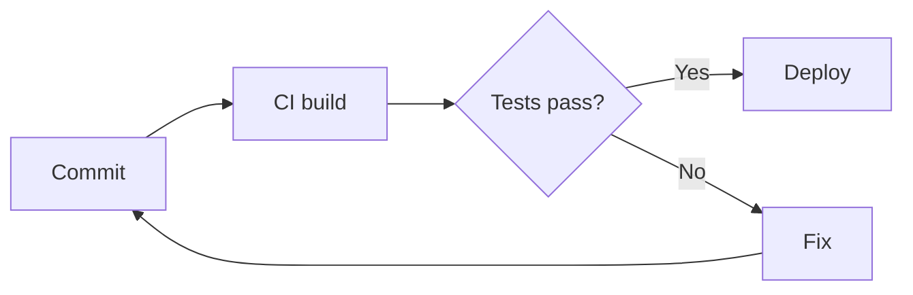

The following Markdown renders incorrectly in either Read or Live view, example screen clips are attached

\#### Closed ATX heading ####
Live view

---
---

This line ends with a backslash\
so this should also be on a new line.
Live view

---
---

Loose list (paragraphs between items):

- First item

- Second item, with a second paragraph.

  This paragraph belongs to the second item.

- Third item
Read view

---

[Inline link with title](https://example.com "Example title")

Both Live and Read View

---
---

[Anchor link to section 3](#3-commonmark--emphasis)

These don't work
---

---

Entities: &copy; &amp; &lt; &gt; &quot; &nbsp; &#169; &#x1F600;

In Live view

---

  <strong>Block-level HTML</strong>

Click to expand (details/summary)

Hidden content with **Markdown** inside.

In Live view, renders as above

---

~Strikethrough with single tilde~

In Live view

---

Highlighted text is a different colour in Live -> Read

Go with Read on the right.

---

Superscript and Subscript with tildes not right
H~2~O (subscript with single tildes)

X^2^ (superscript with carets)

Live -> Read

---
---

:smile: :rocket: :white_check_mark: :warning:

Live and Read views

---
---

Inline maths: $E = mc^2$

Block maths:

$$
\int_{0}^{\infty} e^{-x^2} \, dx = \frac{\sqrt{\pi}}{2}
$$

Live and Read view

---
---

Live and Read views

---

Callouts seem to render with an extra line in Live view
> [!NOTE]
> Useful information.

---

Fotenotes with formatting don't render in Read or Live

